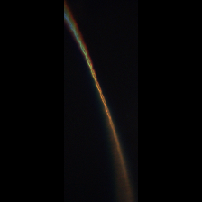
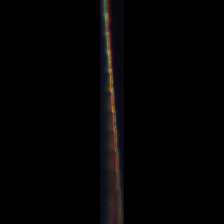
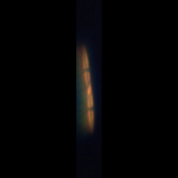
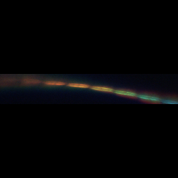
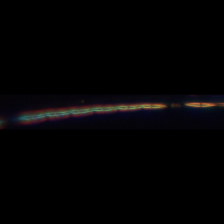
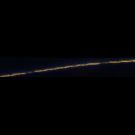
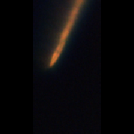
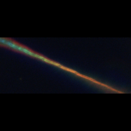
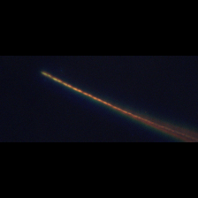
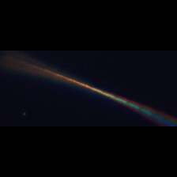

<!-- GENERATED by scripts/build_pages.py — do not edit by hand. Edit meta.yml and re-run the script. -->

**Group:** Diatoms  ·  **Optics:** high-mag, low-mag

## Defining characteristics

Cells are long, narrow, and lanceolate to spindle-shaped (needle-like), tapering to pointed ends. Cells associate into characteristic stepped colonies: each cell overlaps its neighbour by a short length at the pointed tips, so the chain looks like offset stacked needles rather than cells joined face-to-face. Features to key on: (1) Often high length-to-width ratio; (2) the stepped end-overlap between adjacent cells; (3) Two chloroplasts per cell, each on either side of the median transapical (middle) plane. Several species and sub-classes represented here that need to be identified either with molecular probes or SEM.

## Distinguishing from similar classes

| Similar class | How to tell them apart |
|---|---|
| **chaetoceros** | Chaetoceros is centric and bears setae; Pseudo-nitzschia is pennate, seta-less, and forms stepped overlapping ribbons of needle-like cells. Can become challening if cells are further away. |

## Ideal images

::: {layout-ncol="3"}

:::

## Challenging images

::: {layout-ncol="3"}

:::

## References

- [Guide to Pseudo-nitzschia — Diatoms of North America](https://diatoms.org/genera/pseudo-nitzschia/guide)
- [Pseudo-nitzschia — Diatoms of North America (genus)](https://diatoms.org/genera/pseudo-nitzschia)

