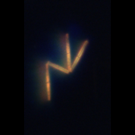
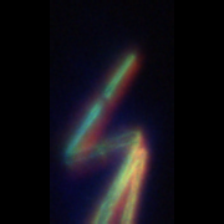

<!-- GENERATED by scripts/build_pages.py — do not edit by hand. Edit meta.yml and re-run the script. -->

**Group:** Diatoms  ·  **Optics:** high-mag, low-mag

## Defining characteristics

Cells are narrow, straight, rod- or bar-shaped with rounded to slightly swollen ends and roughly uniform width along their length. They join at their corners by small mucilage pads to form characteristic zigzag chains or radiating stellate (star) clusters. If single cell, using pennate. Key features: uniform straight bars, corner-to-corner linkage, zigzag or star colony geometry. Thalassionema nitzschioides is the common form.

## Distinguishing from similar classes

| Similar class | How to tell them apart |
|---|---|
| **asterionellopsis** | Asterionellopsis cells are clavate (club-shaped) with one inflated foot pole and taper along their length; Thalassionema cells are near-uniform bars of even width. |
| **pseudo-nitzschia** | Pseudo-nitzschia forms stepped colonies with cells overlapping along their pointed ends, not corner-linked zigzags or stars. |
| **pennate** | Use Thalassionema when the zigzag/stellate colony form is clear; fall back to Pennate if single cell. |

## Ideal images

::: {layout-ncol="3"}

![[High mag]{.mag-badge .mag-badge-high}](ideal/high_mag_cam-1744682936786182-4883570964840-48161-002-366-714-276-112_rawcolor.png){.mag-high}

![[High mag]{.mag-badge .mag-badge-high}](ideal/high_mag_cam-1744859263916532-19522598872624-194455-001-1292-204-176-220_rawcolor.png){.mag-high}

![[High mag]{.mag-badge .mag-badge-high}](ideal/high_mag_cam-1744859271614828-19530298065352-194532-001-510-1086-148-148_rawcolor.png){.mag-high}

![[High mag]{.mag-badge .mag-badge-high}](ideal/high_mag_cam-1744890895773568-15124827821624-150414-000-1786-0-144-144_rawcolor.png){.mag-high}

![[High mag]{.mag-badge .mag-badge-high}](ideal/high_mag_cam-1744957314897830-3141734509648-30533-001-1638-338-116-168_rawcolor.png){.mag-high}

:::

## Challenging images

::: {layout-ncol="1"}

:::

## References

- [Thalassionema — overview (ScienceDirect Topics)](https://www.sciencedirect.com/topics/agricultural-and-biological-sciences/thalassionema)

