<!-- GENERATED by scripts/build_pages.py — do not edit by hand. Edit meta.yml and re-run the script. -->

# Chaetoceros

**Group:** Diatoms  ·  **Optics:** high-mag, low-mag

## Defining characteristics

Cells are joined valve-to-valve into chains with an space between adjacent valves (aperture). Each cell has two or more setae per valve. Setae are long, thin bristles arising from the corners of the valve that may or may not contain branches. In girdle view, cells are generally rectangula. Adjacent cells are connected through fused (touching) setae. Nearlly 400 species described. For planktivore, setae can be difficult to see, except for on a few species with coarser, almost spine like setae.

## Distinguishing from similar classes

| Similar class | How to tell them apart |
|---|---|
| **eucampia** | Eucampia has short, blunt polar horns (not fine setae) and forms curved chains with large lens-shaped apertures. Chaetoceros setae are thin, hair-like, and usually much longer than the cell is wide. |
| **pseudo-nitzschia** | Pseudo-nitzschia is pennate, seta-less, and forms straight stepped ribbons of needle-like cells. If fine bristles project from the cells, it is not Pseudo-nitzschia. |

## Ideal images

::: {layout-ncol="3"}

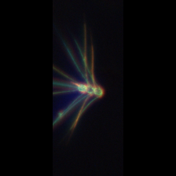

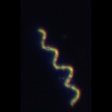

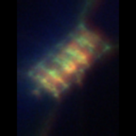

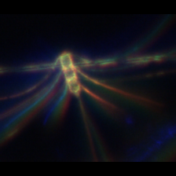

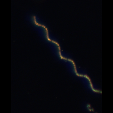

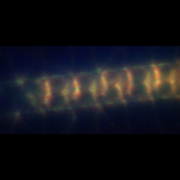

:::

## Challenging images

::: {layout-ncol="3"}

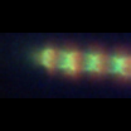

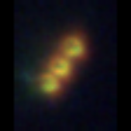

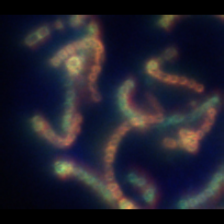

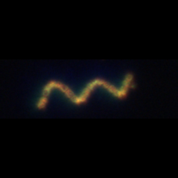

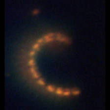

:::

## References

- [Chaetoceros — Diatoms of North America](https://diatoms.org/genera/chaetoceros)
- [WHOI IFCB plankton reference (model guide)](https://whoigit.github.io/whoi-plankton/Chaetoceros.html)
- [UCSC PhytoGallery](http://oceandatacenter.ucsc.edu/PhytoGallery/Diatoms/Chaetoceros.html)

# Eucampia

**Group:** Diatoms  ·  **Optics:** high-mag, low-mag

## Defining characteristics

Cells are elliptical in girdle view and bear two blunt, broad polar elevations ("horns") at each end of the valve. Adjacent cells are joined horn-to-horn, leaving a conspicuous large, lens-shaped (biconvex) aperture between successive cells. Chains can be long or short. Because the horns are often unequal, the whole chain curves, twists, or coils rather than running straight. Key features to key on: (1) blunt, tapering horns (batman); (2) the large apertures between cells; (3) the characteristic curved or spiral chain shape. Eucampia zodiacus is the common large curved-chain form.

## Distinguishing from similar classes

| Similar class | How to tell them apart |
|---|---|
| **chaetoceros** | Chaetoceros bears thin, hair-like setae (bristles) that often project well beyond the cell outline and cross between neighbours. Eucampia's projections are short, blunt horns, not fine setae, and its inter-cell apertures are large and lens-shaped. The aperature shape and size is something to key on. Chaetoceros will be much smaller. |

## Ideal images

::: {layout-ncol="3"}

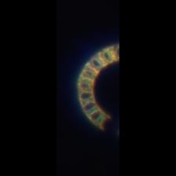

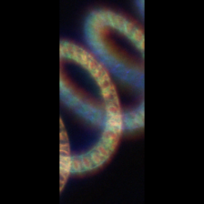

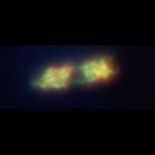

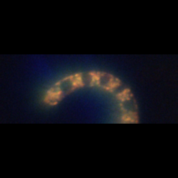

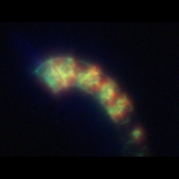

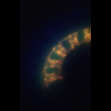

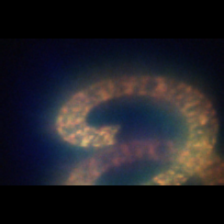

:::

## Challenging images

::: {layout-ncol="3"}

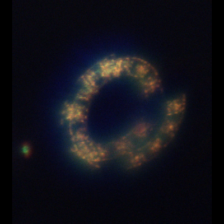

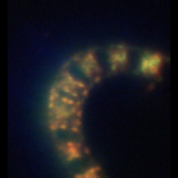

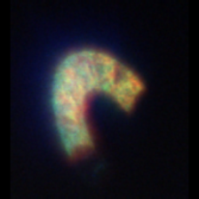

:::

## References

- [Eucampia — Diatoms of North America](https://diatoms.org/genera/eucampia)
- [WHOI IFCB plankton reference (model guide)](https://whoigit.github.io/whoi-plankton/)

# Pseudo-nitzschia

**Group:** Diatoms  ·  **Optics:** high-mag, low-mag

## Defining characteristics

Cells are long, narrow, and lanceolate to spindle-shaped (needle-like), tapering to pointed ends. Cells associate into characteristic stepped colonies: each cell overlaps its neighbour by a short length at the pointed tips, so the chain looks like offset stacked needles rather than cells joined face-to-face. Features to key on: (1) Often high length-to-width ratio; (2) the stepped end-overlap between adjacent cells; (3) Two chloroplasts per cell, each on either side of the median transapical (middle) plane. Several species and sub-classes represented here that need to be identified either with molecular probes or SEM.

## Distinguishing from similar classes

| Similar class | How to tell them apart |
|---|---|
| **chaetoceros** | Chaetoceros is centric and bears setae; Pseudo-nitzschia is pennate, seta-less, and forms stepped overlapping ribbons of needle-like cells. Can become challening if cells are further away. |

## Ideal images

::: {layout-ncol="3"}

:::

## Challenging images

::: {layout-ncol="3"}

:::

## References

- [Guide to Pseudo-nitzschia — Diatoms of North America](https://diatoms.org/genera/pseudo-nitzschia/guide)
- [Pseudo-nitzschia — Diatoms of North America (genus)](https://diatoms.org/genera/pseudo-nitzschia)

