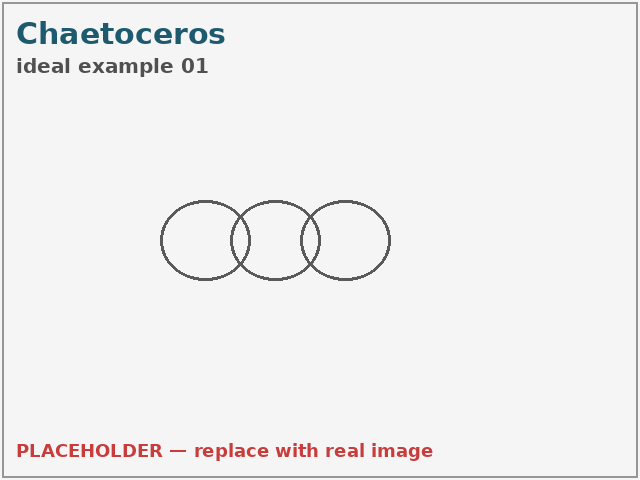
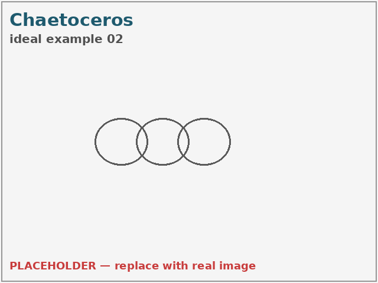
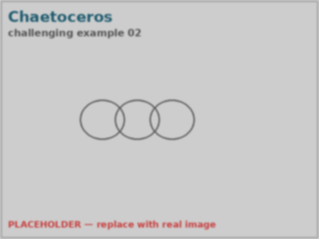
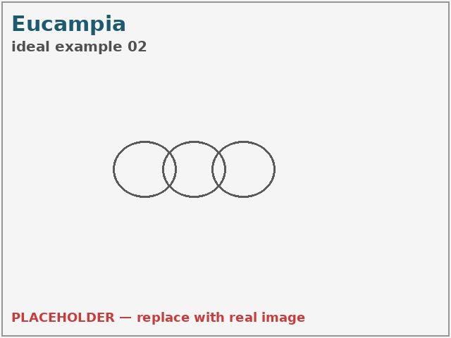
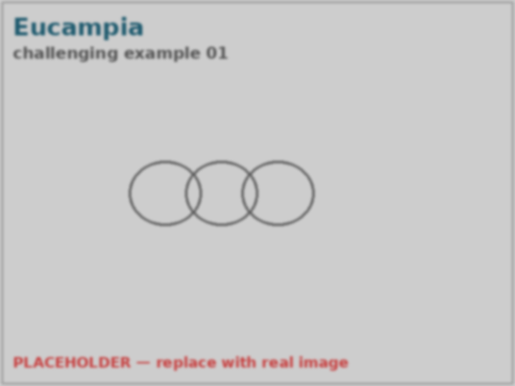
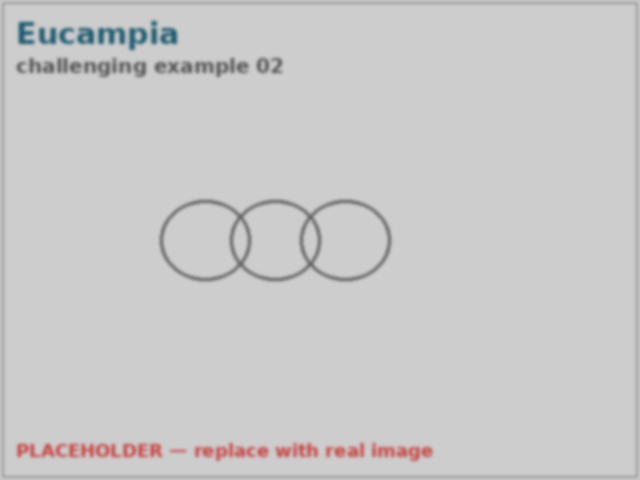
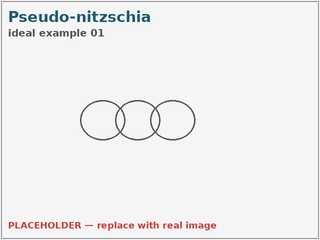
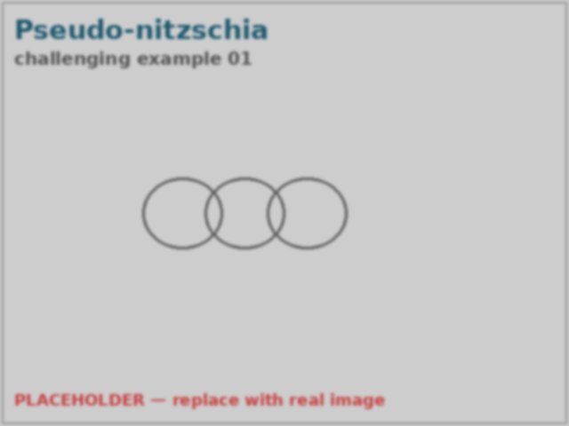

<!-- GENERATED by scripts/build_pages.py — do not edit by hand. Edit meta.yml and re-run the script. -->

# Chaetoceros

**Group:** Diatoms  ·  **Optics:** high-mag, low-mag

## Defining characteristics

Cells are joined valve-to-valve into chains, and each cell bears a pair of long, thin setae (bristles) arising from the corners of the valve. Setae of adjacent cells typically emerge near the cell junction and cross or run parallel, and rectangular or lens-shaped apertures (foramina) are left between successive cells. Features to key on: (1) fine setae projecting well beyond the cell body; (2) setae crossing between neighbours; (3) a defined chain with apertures between cells. Chaetoceros is very species-rich; label to genus unless a project-specific key for a distinctive species is provided.

## Distinguishing from similar classes

| Similar class | How to tell them apart |
|---|---|
| **eucampia** | Eucampia has short, blunt polar horns (not fine setae) and forms curved chains with large lens-shaped apertures. Chaetoceros setae are thin, hair-like, and usually much longer than the cell is wide. |
| **pseudo-nitzschia** | Pseudo-nitzschia is pennate, seta-less, and forms straight stepped ribbons of needle-like cells. If fine bristles project from the cells, it is not Pseudo-nitzschia. |

## Ideal images

::: {layout-ncol="2"}

:::

## Challenging images

::: {layout-ncol="2"}

:::

## References

- [Chaetoceros — Diatoms of North America](https://diatoms.org/genera/chaetoceros)
- [WHOI IFCB plankton reference (model guide)](https://whoigit.github.io/whoi-plankton/)

# Eucampia

**Group:** Diatoms  ·  **Optics:** high-mag, low-mag

## Defining characteristics

Cells are elliptical in girdle view and bear two blunt, broad polar elevations ("horns") at each end of the valve. Adjacent cells are joined horn-to-horn, leaving a conspicuous large, lens-shaped (biconvex) aperture between successive cells. Because the horns are often unequal, the whole chain curves, twists, or coils rather than running straight. Key features to key on: (1) blunt, tapering horns — not thin bristles; (2) the large window-like apertures between cells; (3) the characteristic curved or spiral chain shape. Eucampia zodiacus is the common large curved-chain form.

## Distinguishing from similar classes

| Similar class | How to tell them apart |
|---|---|
| **chaetoceros** | Chaetoceros bears thin, hair-like setae (bristles) that often project well beyond the cell outline and cross between neighbours. Eucampia's projections are short, blunt horns, not fine setae, and its inter-cell apertures are large and lens-shaped. |
| **pseudo-nitzschia** | Pseudo-nitzschia is a pennate diatom forming straight stepped ribbons of narrow, needle-like cells that overlap end-to-end. Eucampia is centric, with blunt horns and curved chains — no end-overlap stepping. |

## Ideal images

::: {layout-ncol="2"}

:::

## Challenging images

::: {layout-ncol="2"}

:::

## References

- [Eucampia — Diatoms of North America](https://diatoms.org/genera/eucampia)
- [WHOI IFCB plankton reference (model guide)](https://whoigit.github.io/whoi-plankton/)

# Pseudo-nitzschia

**Group:** Diatoms  ·  **Optics:** high-mag, low-mag

## Defining characteristics

Cells are long, narrow, and lanceolate to spindle-shaped (needle- or blade-like), tapering to pointed ends. Cells associate into characteristic stepped, shingle-like colonies: each cell overlaps its neighbour by a short length at the pointed tips, so the chain looks like offset stacked needles rather than cells joined face-to-face. Features to key on: (1) very high length-to-width ratio; (2) the stepped end-overlap between adjacent cells; (3) generally straight (not curved) colonies. Species-level identification (e.g. the P. seriata vs P. delicatissima size groups) requires electron microscopy and is not expected at the annotation stage — label to genus.

## Distinguishing from similar classes

| Similar class | How to tell them apart |
|---|---|
| **chaetoceros** | Chaetoceros is centric and bears setae; Pseudo-nitzschia is pennate, seta-less, and forms stepped overlapping ribbons of needle-like cells. |
| **eucampia** | Eucampia forms curved/coiled chains of horned centric cells with large apertures. Pseudo-nitzschia colonies are straight and stepped, with no horns or apertures. |

## Ideal images

::: {layout-ncol="2"}

:::

## Challenging images

::: {layout-ncol="2"}

:::

## References

- [Guide to Pseudo-nitzschia — Diatoms of North America](https://diatoms.org/genera/pseudo-nitzschia/guide)
- [Pseudo-nitzschia — Diatoms of North America (genus)](https://diatoms.org/genera/pseudo-nitzschia)

