<!-- GENERATED by scripts/build_pages.py — do not edit by hand. Edit meta.yml and re-run the script. -->

# Akashiwo

**Group:** Dinoflagellates  ·  **Optics:** high-mag, low-mag

## Defining characteristics

A relatively large athecate ("naked", no armour plates) dinoflagellate that is flattened dorsoventrally, so it looks broad and leaf-like from one side and thin edge-on (taco shapped). The cingulum (girdle) is only modestly displaced, and an apical groove runs over the top of the cell. Cells lack the rigid plate pattern of armored dinoflagellates and can appear brownish from chloroplasts. Often found during mid-mitotitic division. Akashiwo sanguinea forms red tides. Key features: large size, smooth naked outline, bifricated (notched) hypocone and domed epicone.

## Distinguishing from similar classes

| Similar class | How to tell them apart |
|---|---|
| **gyrodinium** | Both are unarmored, however Gyrodinium's cingulum is strongly displaced into an S-shaped (sigmoid), twisted girdle. |

## Ideal images

::: {layout-ncol="3"}

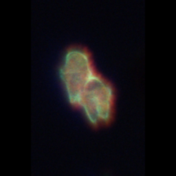

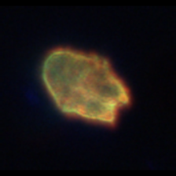

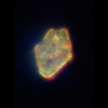

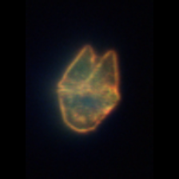

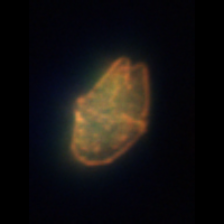

:::

## Challenging images

::: {layout-ncol="3"}

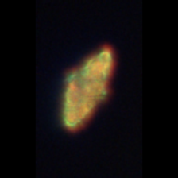

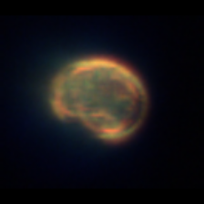

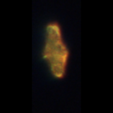

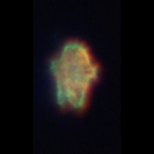

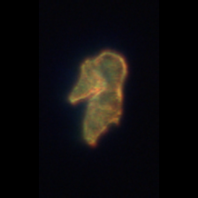

:::

## References

- [Akashiwo sanguinea — UCSC PhytoGallery](http://oceandatacenter.ucsc.edu/PhytoGallery/Dinoflagellates/akashiwo.html)
- [Akashiwo sanguinea — Smithsonian IRL species inventory](https://irlspecies.org/taxa/index.php?taxon=9761)

# Asterionellopsis

**Group:** Diatoms  ·  **Optics:** high-mag, low-mag

## Defining characteristics

Cells are club-shaped (clavate): one end is expanded into a heavier "foot" while the other tapers into a long, fine trailing arm. The foot poles gather at a common centre so the colony radiates outward as a star or helix if chain is long. Key features: markedly unequal cell ends with club, central attachment, star or helical colony. Asterionellopsis glacialis (most common) and Asterionellopsis kariana.

## Distinguishing from similar classes

| Similar class | How to tell them apart |
|---|---|
| **thalassionema** | Asterionellopsis cells are clavate with a distinct foot at the colony centre. |
| **chaetoceros** | Chaetoceros cells are more rounded and rectangular, where Asterionellopsis is agnular. Setae (if visible) radiate from both side of the valve. |

## Ideal images

::: {layout-ncol="3"}

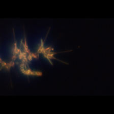

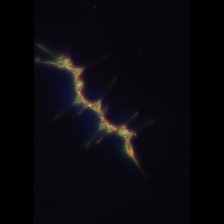

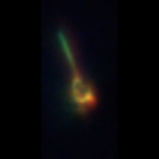

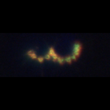

:::

## Challenging images

::: {layout-ncol="3"}

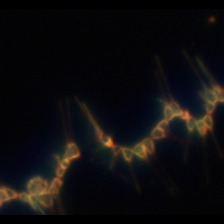

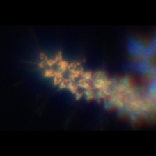

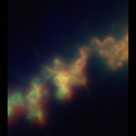

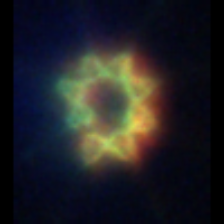

:::

## References

- [Asterionellopsis glacialis — UBC Phytoplankton (EOAS)](https://phytoplankton.eoas.ubc.ca/research/phytoplankton/diatoms/pennate/asterionellopsis/a_glacialis.html)
- [UCSC PhytoGallery - Asterionellopsis](http://oceandatacenter.ucsc.edu/PhytoGallery/Diatoms/Asterionellopsis.html)

# Centric

**Group:** Diatoms  ·  **Optics:** high-mag, low-mag

## Defining characteristics

Centric diatoms are radially symmetric. Cells are typically disc-, drum-, cylinder-, or box-shaped. Use this class for non-chain centric cells that cannot be keyed into other labels. Key features: Circular or polygonal valve outline, often single cells from chain-forming species.

## Distinguishing from similar classes

| Similar class | How to tell them apart |
|---|---|
| **pennate** | Pennate diatoms are elongate and bilaterally symmetric; centric diatoms are radially symmetric. |
| **thalassiosira** | Only use Thalassiosira for single cells if spine is visible, otherwise centric. |

## Ideal images

::: {layout-ncol="3"}

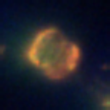

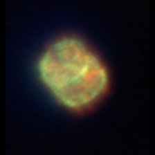

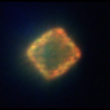

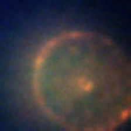

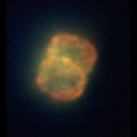

:::

## Challenging images

::: {layout-ncol="2"}

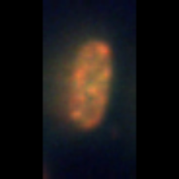

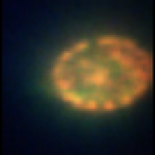

:::

## References

- [UCSC Ocean Data Center — Phytoplankton Gallery](http://oceandatacenter.ucsc.edu/PhytoGallery/)

# Ceratium

**Group:** Dinoflagellates  ·  **Optics:** high-mag, low-mag

## Defining characteristics

An armored dinoflagellate whose plates are drawn out into long, slender horns: a single apical horn and usually two antapical horns that curve upward, giving a distinctive trident silhouette. Species in Monterey also The marine species are now placed in the genus Tripos, but are still often refered to as Ceratium. Key features: multiple long horns, rigid armored plates, relatively large size.

## Distinguishing from similar classes

| Similar class | How to tell them apart |
|---|---|
| **dinophysis** | Dinophysis is laterally flattened with a funnel-shaped cingular list and sail-like sulcal lists, not long horns. |
| **prorocentrum** | Prorocentrum is a two-valved cell with no horns and no girdle; Ceratium has prominent apical and antapical horns. |

## Ideal images

_No images yet — add files to this folder._

## Challenging images

_No images yet — add files to this folder._

## References

- [Ceratium — Wikipedia](https://en.wikipedia.org/wiki/Ceratium)
- [UCSC PhytoGallery](http://oceandatacenter.ucsc.edu/PhytoGallery/Dinoflagellates/ceratium.html)

# Chaetoceros

**Group:** Diatoms  ·  **Optics:** high-mag, low-mag

## Defining characteristics

Cells are joined valve-to-valve into chains with an space between adjacent valves (aperture). Each cell has two or more setae per valve. Setae are long, thin bristles arising from the corners of the valve that may or may not contain branches. In girdle view, cells are generally rectangula. Adjacent cells are connected through fused (touching) setae. Nearlly 400 species described. For planktivore, setae can be difficult to see, except for on a few species with coarser, almost spine like setae.

## Distinguishing from similar classes

| Similar class | How to tell them apart |
|---|---|
| **eucampia** | Eucampia has short, blunt polar horns (not fine setae) and forms curved chains with large lens-shaped apertures. Chaetoceros setae are thin, hair-like, and usually much longer than the cell is wide. |
| **pseudo-nitzschia** | Pseudo-nitzschia is pennate, seta-less, and forms straight stepped ribbons of needle-like cells. If fine bristles project from the cells, it is not Pseudo-nitzschia. |

## Ideal images

::: {layout-ncol="3"}

![[High mag]{.mag-badge .mag-badge-high} Likely _C. similis_](classes/chaetoceros/ideal/high_mag_cam-1744682015955205-3962763148808-38952-003-1984-424-315-320_rawcolor.png){.mag-high}

![[High mag]{.mag-badge .mag-badge-high}](classes/chaetoceros/ideal/high_mag_cam-1744682145937988-4092750162672-40252-000-2024-1182-216-536_rawcolor.png){.mag-high}

![[High mag]{.mag-badge .mag-badge-high}](classes/chaetoceros/ideal/high_mag_cam-1744682978866205-4925666747136-48582-001-814-404-308-484_rawcolor.png){.mag-high}

![[High mag]{.mag-badge .mag-badge-high}](classes/chaetoceros/ideal/high_mag_cam-1744718550795543-27590553820136-275252-001-164-1534-108-144_rawcolor.png){.mag-high}

![[High mag]{.mag-badge .mag-badge-high}](classes/chaetoceros/ideal/high_mag_cam-1744752311476389-3202327294760-31317-006-1964-274-335-280_rawcolor.png){.mag-high}

![[High mag]{.mag-badge .mag-badge-high}](classes/chaetoceros/ideal/high_mag_cam-1744755748077517-6638879062000-65686-003-536-0-648-808_rawcolor.png){.mag-high}

![[High mag]{.mag-badge .mag-badge-high}](classes/chaetoceros/ideal/high_mag_cam-1744755821360650-6712171621432-66419-000-24-1710-204-100_rawcolor.png){.mag-high}

:::

## Challenging images

::: {layout-ncol="3"}

![[High mag]{.mag-badge .mag-badge-high}](classes/chaetoceros/challenging/high_mag_cam-1744681916957124-3863773038648-37962-002-162-594-104-52_rawcolor.png){.mag-high}

![[High mag]{.mag-badge .mag-badge-high}](classes/chaetoceros/challenging/high_mag_cam-1744718611088048-27650847754760-275855-002-1274-210-44-56_rawcolor.png){.mag-high}

![[High mag]{.mag-badge .mag-badge-high}](classes/chaetoceros/challenging/high_mag_cam-1744859255416399-19514099723192-194370-002-770-1788-244-211_rawcolor.png){.mag-high}

![[High mag]{.mag-badge .mag-badge-high}](classes/chaetoceros/challenging/high_mag_cam-1744975608139935-21435133454544-213486-001-1682-1832-312-104_rawcolor.png){.mag-high}

![[High mag]{.mag-badge .mag-badge-high}](classes/chaetoceros/challenging/high_mag_cam-1744975619940032-21446932238568-213604-000-36-1854-132-145_rawcolor.png){.mag-high}

:::

## References

- [Chaetoceros — Diatoms of North America](https://diatoms.org/genera/chaetoceros)
- [WHOI IFCB plankton reference (model guide)](https://whoigit.github.io/whoi-plankton/Chaetoceros.html)
- [UCSC PhytoGallery](http://oceandatacenter.ucsc.edu/PhytoGallery/Diatoms/Chaetoceros.html)

# Dinophysis

**Group:** Dinoflagellates  ·  **Optics:** high-mag, low-mag

## Defining characteristics

A thecate dinoflagellate that is strongly compressed laterally, so it looks like two watch-glasses joined edge to edge (oval or bean-shaped in side view). The anterior end bears a funnel-shaped cingular list (collar), and prominent wing- or sail-like sulcal lists project from the left ventral margin. Several species (e.g. Dinophysis acuminata) produce diarrhetic shellfish toxins. Key features: lateral flattening, funnel cingular list, sail-like sulcal lists.

## Distinguishing from similar classes

| Similar class | How to tell them apart |
|---|---|
| **ceratium** | Ceratium has long apical and antapical horns; Dinophysis has no horns but conspicuous cingular and sulcal lists. |
| **prorocentrum** | Prorocentrum splits into two flat valves along a sagittal suture with an apical spine; Dinophysis has the funnel collar and sail lists. |

## Ideal images

_No images yet — add files to this folder._

## Challenging images

_No images yet — add files to this folder._

## References

- [Dinophysis — overview (ScienceDirect Topics)](https://www.sciencedirect.com/topics/agricultural-and-biological-sciences/dinophysis)

# Ditylum

**Group:** Diatoms  ·  **Optics:** high-mag, low-mag

## Defining characteristics

Cells are elongate prisms — triangular or quadrangular in cross-section — so they look rectangular in girdle view, with a distinctive central spine emerging from the middle of each (usually flat) valve plus a ring of small marginal spines. Often solitary or in short chains and relatively large. Ditylum brightwellii is the common species. Key features: prismatic (polygonal cross-section) box shape, prominent central valve spine.

## Distinguishing from similar classes

| Similar class | How to tell them apart |
|---|---|
| **chaetoceros** | Chaetoceros has thin lateral setae and clear chains with apertures; Ditylum is a box-like cell with one central spine per valve. |
| **centric** | Use Ditylum when the prismatic shape and central spine are visible; fall back to Centric when the genus is unclear. |

## Ideal images

_No images yet — add files to this folder._

## Challenging images

_No images yet — add files to this folder._

## References

- [Ditylum — overview (ScienceDirect Topics)](https://www.sciencedirect.com/topics/agricultural-and-biological-sciences/ditylum)

# Eucampia

**Group:** Diatoms  ·  **Optics:** high-mag, low-mag

## Defining characteristics

Cells are elliptical in girdle view and bear two blunt, broad polar elevations ("horns") at each end of the valve. Adjacent cells are joined horn-to-horn, leaving a conspicuous large, lens-shaped (biconvex) aperture between successive cells. Chains can be long or short. Because the horns are often unequal, the whole chain curves, twists, or coils rather than running straight. Key features to key on: (1) blunt, tapering horns (batman); (2) the large apertures between cells; (3) the characteristic curved or spiral chain shape. Eucampia zodiacus is the common large curved-chain form.

## Distinguishing from similar classes

| Similar class | How to tell them apart |
|---|---|
| **chaetoceros** | Chaetoceros bears thin, hair-like setae (bristles) that often project well beyond the cell outline and cross between neighbours. Eucampia's projections are short, blunt horns, not fine setae, and its inter-cell apertures are large and lens-shaped. The aperature shape and size is something to key on. Chaetoceros will be much smaller. |

## Ideal images

::: {layout-ncol="3"}

![[High mag]{.mag-badge .mag-badge-high}](classes/eucampia/ideal/high_mag_cam-1744681252334368-3199139638296-31315-001-2094-192-205-348_rawcolor.png){.mag-high}

![[High mag]{.mag-badge .mag-badge-high} Girdle view showing cells joined horn-to-horn, appears flat from this perspective.](classes/eucampia/ideal/high_mag_cam-1744681932056855-3878871537760-38113-000-2166-1468-133-376_rawcolor.png){.mag-high}

![[High mag]{.mag-badge .mag-badge-high} Curved-spiral chain; blunt horns and lens-shaped apertures clearly visible.](classes/eucampia/ideal/high_mag_cam-1744682182247330-4129046523624-40615-004-100-1572-168-404_rawcolor.png){.mag-high}

![[High mag]{.mag-badge .mag-badge-high}](classes/eucampia/ideal/high_mag_cam-1744725251348223-34291069001728-342264-003-1836-450-144-60_rawcolor.png){.mag-high}

![[High mag]{.mag-badge .mag-badge-high}](classes/eucampia/ideal/high_mag_cam-1744957316988907-3143834290704-30554-002-196-1250-288-112_rawcolor.png){.mag-high}

![[High mag]{.mag-badge .mag-badge-high}](classes/eucampia/ideal/high_mag_cam-1744975557955809-21384938635112-212984-002-1708-1290-192-144_rawcolor.png){.mag-high}

![[High mag]{.mag-badge .mag-badge-high}](classes/eucampia/ideal/high_mag_cam-1744987119042730-32946129907648-328608-001-2148-1376-151-236_rawcolor.png){.mag-high}

![[High mag]{.mag-badge .mag-badge-high}](classes/eucampia/ideal/high_mag_cam-1744987121567721-32948629653456-328633-003-1484-1096-244-160_rawcolor.png){.mag-high}

:::

## Challenging images

::: {layout-ncol="3"}

![[High mag]{.mag-badge .mag-badge-high}](classes/eucampia/challenging/high_mag_cam-1744957305295276-3132135504592-30437-005-1614-1498-356-400_rawcolor.png){.mag-high}

![[High mag]{.mag-badge .mag-badge-high} Focusing in on the large apperature.](classes/eucampia/challenging/high_mag_cam-1744975618846879-21445832356272-213593-003-1718-594-172-188_rawcolor.png){.mag-high}

![[High mag]{.mag-badge .mag-badge-high}](classes/eucampia/challenging/high_mag_cam-1744987134650896-32961728289728-328764-000-416-1140-172-192_rawcolor.png){.mag-high}

:::

## References

- [Eucampia — UCSC PhytoGallery](http://oceandatacenter.ucsc.edu/PhytoGallery/Diatoms/Eucampia.html)
- [WHOI IFCB plankton reference (model guide)](https://whoigit.github.io/whoi-plankton/Eucampia.html)

# Gyrodinium

**Group:** Dinoflagellates  ·  **Optics:** high-mag, low-mag

## Defining characteristics

An athecate ("naked") dinoflagellate whose defining trait is a cingulum (girdle) that is strongly displaced and often wound into an S-shape, so the two halves of the cell (epicone and hypocone) look twisted relative to each other. Key features: naked outline, cingulum displacement more than 1/3 body length, food vacuoles often present

## Distinguishing from similar classes

| Similar class | How to tell them apart |
|---|---|
| **akashiwo** | Akashiwo is larger and dorsoventrally flattened with only a slightly offset girdle; Gyrodinium is defined by its strongly displaced, twisted (sigmoid) cingulum. |

## Ideal images

::: {layout-ncol="3"}

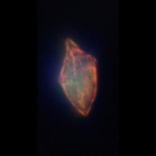

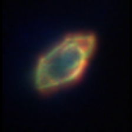

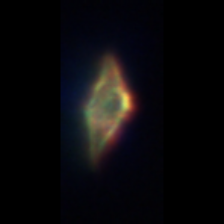

:::

## Challenging images

::: {layout-ncol="3"}

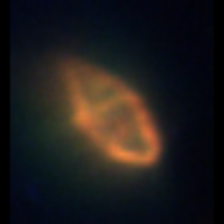

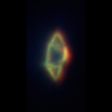

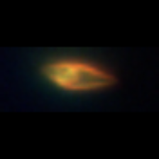

:::

## References

- [Gyrodinium — Wikipedia](https://en.wikipedia.org/wiki/Gyrodinium)
- [UCSC Ocean Data Center — Phytoplankton Gallery](http://oceandatacenter.ucsc.edu/PhytoGallery/Dinoflagellates/gyrodinium.html)

# Pennate

**Group:** Diatoms  ·  **Optics:** high-mag, low-mag

## Defining characteristics

Pennate diatoms are elongate and bilaterally (mirror) symmetrical. They can be boat-, rod-, needle-, or wedge-shaped in valve view. Use this class for pennate cells that are clearly not centric but cannot be keyed with confidence to one of the named pennate genera in this guide. This includes non-chain (or clipped) Pseudo-nitzschia, which cannot be easily distinguished from other single celled pennates. Key features: elongate bilateral outline, no setae.

## Distinguishing from similar classes

| Similar class | How to tell them apart |
|---|---|
| **pseudo-nitzschia** | Label Pseudo-nitzschia when narrow needle-like cells form stepped, end-overlapping chains |

## Ideal images

::: {layout-ncol="3"}

![[High mag]{.mag-badge .mag-badge-high}](classes/pennate/ideal/high_mag_cam-1744678828278475-775083463728-7072-003-334-404-84-136_rawcolor.png){.mag-high}

![[High mag]{.mag-badge .mag-badge-high}](classes/pennate/ideal/high_mag_cam-1744682255848441-4202639157240-41351-002-1732-930-72-28_rawcolor.png){.mag-high}

![[High mag]{.mag-badge .mag-badge-high}](classes/pennate/ideal/high_mag_cam-1744682947262736-4894069897432-48266-001-1224-740-160-144_rawcolor.png){.mag-high}

![[High mag]{.mag-badge .mag-badge-high}](classes/pennate/ideal/high_mag_cam-1744695785860467-4825753985488-47581-000-1022-1600-24-76_rawcolor.png){.mag-high}

![[High mag]{.mag-badge .mag-badge-high}](classes/pennate/ideal/high_mag_cam-1744718636285574-27676045128704-276107-002-1190-1736-104-68_rawcolor.png){.mag-high}

:::

## Challenging images

::: {layout-ncol="3"}

![[High mag]{.mag-badge .mag-badge-high}](classes/pennate/challenging/high_mag_cam-1744745776450520-18292538311888-182199-001-1422-430-72-40_rawcolor.png){.mag-high}

![[High mag]{.mag-badge .mag-badge-high}](classes/pennate/challenging/high_mag_cam-1744749241176327-132037199376-611-002-782-966-68-112_rawcolor.png){.mag-high}

![[High mag]{.mag-badge .mag-badge-high}](classes/pennate/challenging/high_mag_cam-1744917950542668-1854942695728-17696-001-1542-436-56-16_rawcolor.png){.mag-high}

![[High mag]{.mag-badge .mag-badge-high}](classes/pennate/challenging/high_mag_cam-1744970311947022-16138886336216-160518-000-1512-1708-44-84_rawcolor.png){.mag-high}

:::

## References

- [UCSC Ocean Data Center — Phytoplankton Gallery](http://oceandatacenter.ucsc.edu/PhytoGallery/)

# Prorocentrum

**Group:** Dinoflagellates  ·  **Optics:** high-mag, low-mag

## Defining characteristics

A "desmokont" dinoflagellate whose theca is made of two large valves joined along a sagittal (lengthwise) suture, like a clam shell or shield, with no cingulum or sulcus grooves. The two flagella emerge together from an apical periflagellar area that often bears a small tooth or spine. Cells are oval, heart-, or teardrop-shaped in valve view. Key features: two-valve clam-like theca, apical flagellar pore with spine, absence of a girdle.

## Distinguishing from similar classes

| Similar class | How to tell them apart |
|---|---|
| **dinophysis** | Dinophysis is also two-parted but bears a funnel cingular list and sail-like sulcal lists; Prorocentrum is a plain two-valved cell with an apical spine and no lists. |
| **ceratium** | Ceratium has long horns and an obvious girdle; Prorocentrum has neither. |

## Ideal images

_No images yet — add files to this folder._

## Challenging images

_No images yet — add files to this folder._

## References

- [Prorocentrum — overview (ScienceDirect Topics)](https://www.sciencedirect.com/topics/agricultural-and-biological-sciences/prorocentrum)

# Pseudo-nitzschia

**Group:** Diatoms  ·  **Optics:** high-mag, low-mag

## Defining characteristics

Cells are long, narrow, and lanceolate to spindle-shaped (needle-like), tapering to pointed ends. Cells associate into characteristic stepped colonies: each cell overlaps its neighbour by a short length at the pointed tips, so the chain looks like offset stacked needles rather than cells joined face-to-face. Features to key on: (1) Often high length-to-width ratio; (2) the stepped end-overlap between adjacent cells; (3) Two chloroplasts per cell, each on either side of the median transapical (middle) plane. Several species and sub-classes represented here that need to be identified either with molecular probes or SEM.

## Distinguishing from similar classes

| Similar class | How to tell them apart |
|---|---|
| **chaetoceros** | Chaetoceros is centric and bears setae; Pseudo-nitzschia is pennate, seta-less, and forms stepped overlapping ribbons of needle-like cells. Can become challening if cells are further away. |

## Ideal images

::: {layout-ncol="3"}

![[High mag]{.mag-badge .mag-badge-high}](classes/pseudo-nitzschia/ideal/high_mag_cam-1744681982168009-3928966534136-38614-008-1460-240-324-892_rawcolor.png){.mag-high}

![[High mag]{.mag-badge .mag-badge-high}](classes/pseudo-nitzschia/ideal/high_mag_cam-1744682138741082-4085550877728-40180-000-366-0-88-828_rawcolor.png){.mag-high}

![[High mag]{.mag-badge .mag-badge-high} Short two-cell chain, pennate form and overlapping cells are easily identified.](classes/pseudo-nitzschia/ideal/high_mag_cam-1744692707444837-1747363172760-16794-001-674-28-52-360_rawcolor.png){.mag-high}

![[High mag]{.mag-badge .mag-badge-high}](classes/pseudo-nitzschia/ideal/high_mag_cam-1744749339872828-230727518392-1598-000-386-110-536-92_rawcolor.png){.mag-high}

![[High mag]{.mag-badge .mag-badge-high} Longer chain, with missing non-living cells.](classes/pseudo-nitzschia/ideal/high_mag_cam-1744844480536882-4739089365192-46605-000-1622-502-668-104_rawcolor.png){.mag-high}

![[High mag]{.mag-badge .mag-badge-high}](classes/pseudo-nitzschia/ideal/high_mag_cam-1744855930034942-16188639064160-161112-003-436-98-1032-144_rawcolor.png){.mag-high}

:::

## Challenging images

::: {layout-ncol="3"}

![[High mag]{.mag-badge .mag-badge-high}](classes/pseudo-nitzschia/challenging/high_mag_cam-1744681997069824-3943865051760-38763-000-938-0-120-240_rawcolor.png){.mag-high}

![[High mag]{.mag-badge .mag-badge-high}](classes/pseudo-nitzschia/challenging/high_mag_cam-1744749238571303-129437429272-585-000-1846-1806-453-193_rawcolor.png){.mag-high}

![[High mag]{.mag-badge .mag-badge-high} Long chain, moving out of the focal plane. Focusing on the pattern of the chloroplasts (two per cell) and the overlap between cells.](classes/pseudo-nitzschia/challenging/high_mag_cam-1744859240532485-19499201219112-194221-000-1370-574-792-344_rawcolor.png){.mag-high}

![[High mag]{.mag-badge .mag-badge-high} Pennate form is a key identified for longer chains.](classes/pseudo-nitzschia/challenging/high_mag_cam-1744859266515834-19525198603136-194481-000-1444-1600-696-300_rawcolor.png){.mag-high}

:::

## References

- [Guide to Pseudo-nitzschia — Diatoms of North America](https://diatoms.org/genera/pseudo-nitzschia/guide)
- [Pseudo-nitzschia — Diatoms of North America (genus)](https://diatoms.org/genera/pseudo-nitzschia)

# Rhizosolenia / Proboscia

**Group:** Diatoms  ·  **Optics:** high-mag, low-mag

## Defining characteristics

Both genera are elongate, rod- to needle-like centric diatoms, many times longer than wide, occurring singly or in straight chains. Cells are cylindrical with numerous girdle bands and an obliquely conical apex drawn out into a fine process. In Rhizosolenia the apex bears an external process with small wing-like flaps (otaria) and paired claspers that link cells; in Proboscia the apex is extended into a curved, hollow "proboscis" and the claspers/otaria are absent. They are grouped here because at annotation resolution the two are routinely hard to separate. Key features: very high length-to-width ratio, cylindrical body, single tapering apical process.

## Distinguishing from similar classes

| Similar class | How to tell them apart |
|---|---|
| **chaetoceros** | Chaetoceros bears thin lateral setae from the valve corners and forms obvious chains with apertures; Rhizosolenia/Proboscia is a single long cylinder with one apical process, not lateral bristles. |
| **pennate** | Pennate diatoms are bilaterally symmetric; Rhizosolenia/Proboscia are centric (radially symmetric) cylinders. |

## Ideal images

::: {layout-ncol="3"}

![[High mag]{.mag-badge .mag-badge-high}](classes/rhizosolenia_proboscia/ideal/high_mag_cam-1744679665986411-1612798158784-15450-000-1530-826-100-348_rawcolor.png){.mag-high}

![[High mag]{.mag-badge .mag-badge-high}](classes/rhizosolenia_proboscia/ideal/high_mag_cam-1744695959544607-4999435980544-49318-002-0-154-576-80_rawcolor.png){.mag-high}

![[High mag]{.mag-badge .mag-badge-high}](classes/rhizosolenia_proboscia/ideal/high_mag_cam-1744844604507859-4863076773760-47845-000-478-1054-352-224_rawcolor.png){.mag-high}

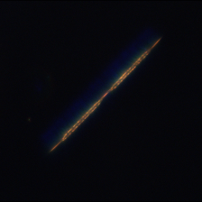

:::

## Challenging images

::: {layout-ncol="3"}

![[High mag]{.mag-badge .mag-badge-high}](classes/rhizosolenia_proboscia/challenging/high_mag_cam-1744692709648106-1749562937544-16816-001-1626-0-184-364_rawcolor.png){.mag-high}

![[High mag]{.mag-badge .mag-badge-high}](classes/rhizosolenia_proboscia/challenging/high_mag_cam-1744859046744010-19305421070728-192283-000-830-1308-100-104_rawcolor.png){.mag-high}

![[High mag]{.mag-badge .mag-badge-high}](classes/rhizosolenia_proboscia/challenging/high_mag_cam-1744987170643238-32997724576272-329124-002-82-140-368-140_rawcolor.png){.mag-high}

:::

## References

- [Rhizosolenia — UCSC Ocean Data Center Phytoplankton Gallery](http://oceandatacenter.ucsc.edu/PhytoGallery/Diatoms/rhizosolenia.html)
- [Morphology of genus Proboscia and related Rhizosoleniaceae (Algae journal)](https://www.e-algae.org/journal/view.php?number=2644)

# Skeletonema

**Group:** Diatoms  ·  **Optics:** high-mag, low-mag

## Defining characteristics

Cells are small, drum- to cylinder-shaped centric diatoms joined into straight chains. Adjacent cells are connected by a ring of long external tubular processes (strutted processes / fultoportulae) around the valve margin, leaving a characteristic open, ladder-like gap between neighbouring cells. Skeletonema costatum is the classic form. Key features: chains of small cylinders, marginal ring of linking tubes, visible inter-cell gap.

## Distinguishing from similar classes

| Similar class | How to tell them apart |
|---|---|
| **thalassiosira** | Thalassiosira cells hang from a single fine central thread and sit close together; Skeletonema cells are bridged by a ring of marginal tubes with an obvious gap. |
| **chaetoceros** | Chaetoceros links cells with thin setae from the corners, not a marginal ring of tubular processes. |

## Ideal images

_No images yet — add files to this folder._

## Challenging images

_No images yet — add files to this folder._

## References

- [Guide to Skeletonema — Diatoms of North America](https://diatoms.org/genera/skeletonema/guide)

# Thalassionema

**Group:** Diatoms  ·  **Optics:** high-mag, low-mag

## Defining characteristics

Cells are narrow, straight, rod- or bar-shaped with rounded to slightly swollen ends and roughly uniform width along their length. They join at their corners by small mucilage pads to form characteristic zigzag chains or radiating stellate (star) clusters. If single cell, using pennate. Key features: uniform straight bars, corner-to-corner linkage, zigzag or star colony geometry. Thalassionema nitzschioides is the common form.

## Distinguishing from similar classes

| Similar class | How to tell them apart |
|---|---|
| **asterionellopsis** | Asterionellopsis cells are clavate (club-shaped) with one inflated foot pole and taper along their length; Thalassionema cells are near-uniform bars of even width. |
| **pseudo-nitzschia** | Pseudo-nitzschia forms stepped colonies with cells overlapping along their pointed ends, not corner-linked zigzags or stars. |
| **pennate** | Use Thalassionema when the zigzag/stellate colony form is clear; fall back to Pennate if single cell. |

## Ideal images

::: {layout-ncol="3"}

![[High mag]{.mag-badge .mag-badge-high}](classes/thalassionema/ideal/high_mag_cam-1744682936786182-4883570964840-48161-002-366-714-276-112_rawcolor.png){.mag-high}

![[High mag]{.mag-badge .mag-badge-high}](classes/thalassionema/ideal/high_mag_cam-1744859263916532-19522598872624-194455-001-1292-204-176-220_rawcolor.png){.mag-high}

![[High mag]{.mag-badge .mag-badge-high}](classes/thalassionema/ideal/high_mag_cam-1744859271614828-19530298065352-194532-001-510-1086-148-148_rawcolor.png){.mag-high}

![[High mag]{.mag-badge .mag-badge-high}](classes/thalassionema/ideal/high_mag_cam-1744890895773568-15124827821624-150414-000-1786-0-144-144_rawcolor.png){.mag-high}

![[High mag]{.mag-badge .mag-badge-high}](classes/thalassionema/ideal/high_mag_cam-1744957314897830-3141734509648-30533-001-1638-338-116-168_rawcolor.png){.mag-high}

:::

## Challenging images

::: {layout-ncol="1"}

:::

## References

- [Thalassionema — overview (ScienceDirect Topics)](https://www.sciencedirect.com/topics/agricultural-and-biological-sciences/thalassionema)

# Thalassiosira

**Group:** Diatoms  ·  **Optics:** high-mag, low-mag

## Defining characteristics

Cells are circular in valve view and disc- to drum-shaped, with areolae in radial or fasciculate rows and a ring of marginal processes. They frequently form loose chains held together by a single thin organic thread extruded from a central process, or occur singly. Key features: circular valve, radial areolae, central-thread linkage rather than marginal tubes.

## Distinguishing from similar classes

| Similar class | How to tell them apart |
|---|---|
| **skeletonema** | Skeletonema is bridged by a ring of long marginal tubes leaving a clear gap; Thalassiosira chains hang from one fine central thread with cells close together. |
| **centric** | Use Thalassiosira when the disc shape and central-thread chains are evident; use Centric when the genus can't be resolved. |

## Ideal images

_No images yet — add files to this folder._

## Challenging images

_No images yet — add files to this folder._

## References

- [UCSC Ocean Data Center — Phytoplankton Gallery](http://oceandatacenter.ucsc.edu/PhytoGallery/)

