<!-- GENERATED by scripts/build_pages.py — do not edit by hand. Edit meta.yml and re-run the script. -->

A visual reference for annotating [Planktivore](about.qmd) plankton images. Click any specimen for its defining characteristics, look-alikes, and more examples.

## Ciliates

::: {.quick-grid}
[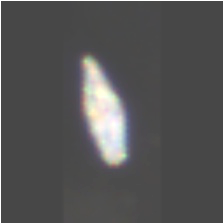{.qg-img} Tiarina](classes/tiarina/index.qmd){.qg-item}

[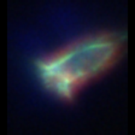{.qg-img} Tintinnid](classes/tintinnid/index.qmd){.qg-item}

:::

## Diatoms

::: {.quick-grid}
[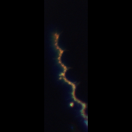{.qg-img} Asterionellopsis](classes/asterionellopsis/index.qmd){.qg-item}

[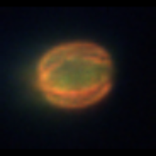{.qg-img} Centric](classes/centric/index.qmd){.qg-item}

[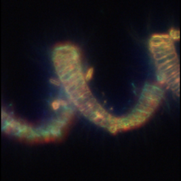{.qg-img} Chaetoceros](classes/chaetoceros/index.qmd){.qg-item}

[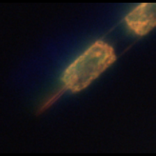{.qg-img} Ditylum](classes/ditylum/index.qmd){.qg-item}

[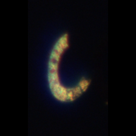{.qg-img} Eucampia](classes/eucampia/index.qmd){.qg-item}

[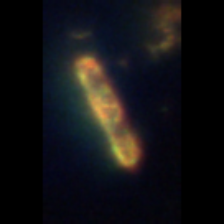{.qg-img} Pennate](classes/pennate/index.qmd){.qg-item}

[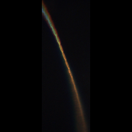{.qg-img} Pseudo-nitzschia](classes/pseudo-nitzschia/index.qmd){.qg-item}

[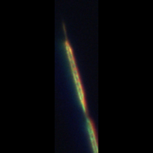{.qg-img} Rhizosolenia / Proboscia](classes/rhizosolenia_proboscia/index.qmd){.qg-item}

[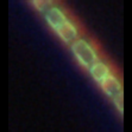{.qg-img} Skeletonema](classes/skeletonema/index.qmd){.qg-item}

[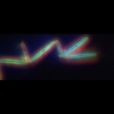{.qg-img} Thalassionema](classes/thalassionema/index.qmd){.qg-item}

[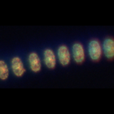{.qg-img} Thalassiosira](classes/thalassiosira/index.qmd){.qg-item}

:::

## Dinoflagellates

::: {.quick-grid}
[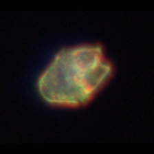{.qg-img} Akashiwo](classes/akashiwo/index.qmd){.qg-item}

[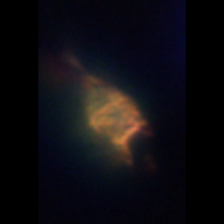{.qg-img} Ceratium](classes/ceratium/index.qmd){.qg-item}

[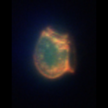{.qg-img} Dinophysis](classes/dinophysis/index.qmd){.qg-item}

[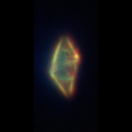{.qg-img} Gyrodinium](classes/gyrodinium/index.qmd){.qg-item}

[no image yet Margalefidinium](classes/margalefidinium/index.qmd){.qg-item}

[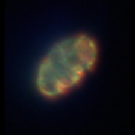{.qg-img} Polykrikos](classes/polykrikos/index.qmd){.qg-item}

[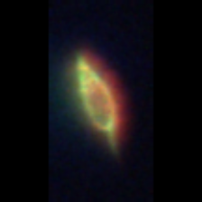{.qg-img} Prorocentrum](classes/prorocentrum/index.qmd){.qg-item}

:::

## Other

::: {.quick-grid}
[no image yet Dictyocha](classes/dictyocha/index.qmd){.qg-item}

[no image yet Heterosigma](classes/heterosigma/index.qmd){.qg-item}

[no image yet Phaeocystis](classes/phaeocystis/index.qmd){.qg-item}

:::

