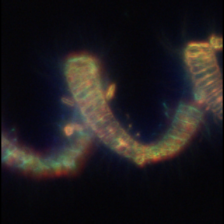
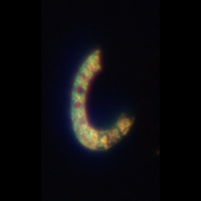

<!-- GENERATED by scripts/build_pages.py — do not edit by hand. Edit meta.yml and re-run the script. -->

::: {.quick-grid}
[no image yet Akashiwo](classes/akashiwo/index.qmd){.qg-item}

[no image yet Asterionellopsis](classes/asterionellopsis/index.qmd){.qg-item}

[{.qg-img} Chaetoceros](classes/chaetoceros/index.qmd){.qg-item}

[{.qg-img} Eucampia](classes/eucampia/index.qmd){.qg-item}

[no image yet Gyrodinium](classes/gyrodinium/index.qmd){.qg-item}

[no image yet Pennate](classes/pennate/index.qmd){.qg-item}

[{.qg-img} Pseudo-nitzschia](classes/pseudo-nitzschia/index.qmd){.qg-item}

[no image yet Rhizosolenia / Proboscia](classes/rhizosolenia_proboscia/index.qmd){.qg-item}

[no image yet Thalassionema](classes/thalassionema/index.qmd){.qg-item}

:::

