<!-- GENERATED by scripts/build_pages.py — do not edit by hand. Edit meta.yml and re-run the script. -->

::: {.quick-grid}
[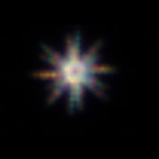{.qg-img} Acantharia](classes/acantharia/index.qmd){.qg-item}

[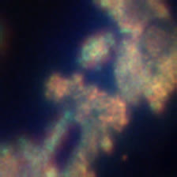{.qg-img} Aggregate](classes/aggregate/index.qmd){.qg-item}

[{.qg-img} Akashiwo](classes/akashiwo/index.qmd){.qg-item}

[{.qg-img} Asterionellopsis](classes/asterionellopsis/index.qmd){.qg-item}

[no image yet Blur](classes/blur/index.qmd){.qg-item}

[no image yet Bubble](classes/bubble/index.qmd){.qg-item}

[{.qg-img} Centric](classes/centric/index.qmd){.qg-item}

[{.qg-img} Ceratium](classes/ceratium/index.qmd){.qg-item}

[{.qg-img} Chaetoceros](classes/chaetoceros/index.qmd){.qg-item}

[no image yet Ciliate](classes/ciliate/index.qmd){.qg-item}

[no image yet circle_1](classes/circle_1/index.qmd){.qg-item}

[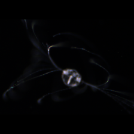{.qg-img} Ctenophora](classes/ctenophora/index.qmd){.qg-item}

[no image yet Dense](classes/dense/index.qmd){.qg-item}

[no image yet Diatom Chain 1 (low mag)](classes/diatom_chain_1/index.qmd){.qg-item}

[no image yet Diatom Chain 2 (low mag)](classes/diatom_chain_2/index.qmd){.qg-item}

[no image yet Diatom Chain 3 (low mag)](classes/diatom_chain_3/index.qmd){.qg-item}

[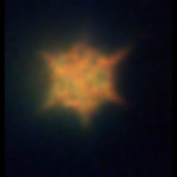{.qg-img} Dictyocha](classes/dictyocha/index.qmd){.qg-item}

[{.qg-img} Dinophysis](classes/dinophysis/index.qmd){.qg-item}

[{.qg-img} Ditylum](classes/ditylum/index.qmd){.qg-item}

[{.qg-img} Eucampia](classes/eucampia/index.qmd){.qg-item}

[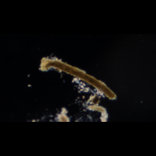{.qg-img} Fecal Pellet (long)](classes/fecal_pellet_long/index.qmd){.qg-item}

[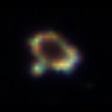{.qg-img} Fecal Pellet (short)](classes/fecal_pellet_short/index.qmd){.qg-item}

[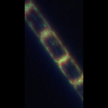{.qg-img} Guinardia / Dactyliosolen / Cerataulina](classes/guinardia_dactyliosolen_cerataulina/index.qmd){.qg-item}

[{.qg-img} Gyrodinium](classes/gyrodinium/index.qmd){.qg-item}

[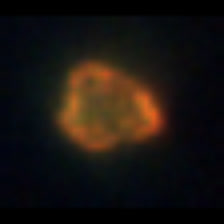{.qg-img} Heterosigma](classes/heterosigma/index.qmd){.qg-item}

[no image yet Larvacean](classes/larvacean/index.qmd){.qg-item}

[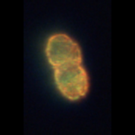{.qg-img} Margalefidinium](classes/margalefidinium/index.qmd){.qg-item}

[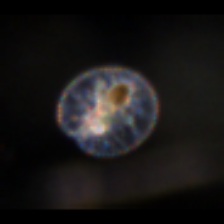{.qg-img} Noctiluca](classes/noctiluca/index.qmd){.qg-item}

[{.qg-img} Pennate](classes/pennate/index.qmd){.qg-item}

[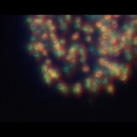{.qg-img} Phaeocystis](classes/phaeocystis/index.qmd){.qg-item}

[no image yet Phaeodarian](classes/phaeodarian/index.qmd){.qg-item}

[{.qg-img} Polykrikos](classes/polykrikos/index.qmd){.qg-item}

[{.qg-img} Prorocentrum](classes/prorocentrum/index.qmd){.qg-item}

[{.qg-img} Pseudo-nitzschia](classes/pseudo-nitzschia/index.qmd){.qg-item}

[{.qg-img} Rhizosolenia / Proboscia](classes/rhizosolenia_proboscia/index.qmd){.qg-item}

[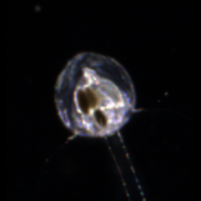{.qg-img} Siphonophore](classes/siphonophore/index.qmd){.qg-item}

[{.qg-img} Skeletonema](classes/skeletonema/index.qmd){.qg-item}

[{.qg-img} Thalassionema](classes/thalassionema/index.qmd){.qg-item}

[{.qg-img} Thalassiosira](classes/thalassiosira/index.qmd){.qg-item}

[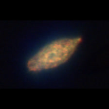{.qg-img} Tiarina](classes/tiarina/index.qmd){.qg-item}

[{.qg-img} Tintinnid](classes/tintinnid/index.qmd){.qg-item}

:::

